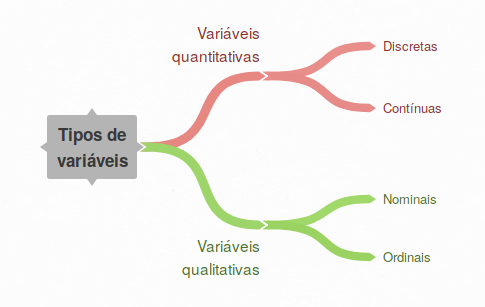

```{r setup, include=FALSE}
knitr::opts_chunk$set(echo = TRUE,
                      warning = FALSE,
                      message = FALSE,
                      out.width = "80%",
                      out.height = "80%")
options(scipen = 999)
```

```{r pacotes, include = FALSE}
library(blogdown)
library(dplyr)
```

## R e RStudio

O `R` é um ambiente e também uma linguagem para a computação estatística e a
produção de gráficos. Basicamente é um programa de linha de
comando^\@ref(fig:R)^, que permite acessar, manipular e visualizar dados,
criando e guardando rotinas de análise que podem ser compartilhadas e
replicadas tanto na forma de *scripts* como na forma de pacotes.

O programa surgiu em meados dos anos 1990 como uma alternativa para computação
estatística (gratuita e de código aberto) feita para profissionais cuja origem
não era a das ciências da computação. A linguagem `R` é uma implementação da 
linguagem S e seu desenvolvimento é gerido pela *R Foundation* (<a href =
"https://www.r-project.org/about.html", target = "_blank">clique aqui para
saber mais</a>).

### Interface do R

```{r R, echo = FALSE, fig.align='center', fig.cap = "Interface do R"}
knitr::include_graphics("img/interface-r.png")
```

O `R` está disponível para usuários de Linux, Windows e OS X (Mac). Nos últimos
10 anos, principalmente, vem tornando-se uma ferramenta bastante popular. Entre
as razões principais desta popularidade, podemos citar:

* É fácil estender capacidades do programa ou sistematizar modelos de análise
com novas funções e pacotes;

* Viabiliza todo o ciclo da ciência de dados, da coleta dos dados à comunicação
dos resultados;

* É código aberto, gratuito

* Tem uma grande comunidade que dá suporte por listas de e-mail, com
documentações e tutoriais e que é bastante ativa no
<a href = "https://stackoverflow.com/", target = "blank_">Stack Overflow</a>;

* Tem um ambiente de desenvolvimento (*IDE*, *Integrated Development Environment*,
da sigla em inglês) sólido, o RStudio, que vem evoluindo rapidamente, ganhando
robustez e maiores possibilidades de uso;

* É uma das linguagens estatísticas de mais rápido crescimento em termos de
usuários gerais e também no mundo corporativo.

Um dado impressionante, por exemplo, e que expressa o crescimento do uso do
`R`, é a evolução da quantidade de pacotes disponíveis no <a href =
"https://cran.r-project.org/", target = "blank_">CRAN (Comprehensive R Archive
Network)</a>, conforme figura abaixo^\@ref(fig:cran)^. Os pacotes são como
compilados de funções e dados que podem ser instalados no `R` e o CRAN é
um repositório de pacotes, com o qual os usuários podem contribuir e
disponibilizar os pacotes criados.

```{r cran, echo=FALSE, fig.align='center', fig.cap='Número de pacotes publicados no CRAN', fig.width=5, fig.height=3}
# Baixar os dados diretamente do repositório no github
df <- read.csv("https://gist.githubusercontent.com/daroczig/3cf06d6db4be2bbe3368/raw/d16b3da080c149c88b5fd9722d3c3c02e4c8644d/results.csv")

library(ggplot2)

ggplot(df, aes(x = as.Date(first_release), y = index)) +
  geom_line(size = 1) +
  scale_x_date(date_breaks = '2 year', date_labels = '%Y') +
  scale_y_continuous(breaks = seq(0, 14000, 1000)) +
  labs(caption = "Fonte: dados de github.com/daroczig obtidos do CRAN",
       x = NULL, y = NULL) +
  theme_light()
```

Além disso o `R` tem um poderoso IDE, chamado de <a href = 
"https://www.rstudio.com/", target = "blank_">RStudio</a>, que oferece uma
interface muito amigável para uso do programa^\@ref(fig:RStudio)^.
Mantendo o foco na linha de comando, ele extende as funcionalidades do `R`
otimizando a criação e gestão de projetos, facilitando a edição de *scripts*,
além de agregar na mesma interface áreas que dão acesso aos códigos, aos
objetos, aos arquivos, às visualizações e outras ferramentas.

### Interface do RStudio

```{r RStudio, echo = FALSE, fig.align='center', fig.cap = "Interface do RStudio"}
knitr::include_graphics("img/interface-rstudio.png")
```

A imagem acima mostra a interface do RStudio. É importante conhecermos ao menos
o básico do seu ambiente de trabalho, pois será com ele que trabalharemos no
curso. As áreas que mais usaremos serão as seguintes:

* **Editor/Scripts**: é o quadrante superior à esquerda, onde escrevemos os
códigos para guardar;
  
* **Console**: é o quadrante inferior à esquerda, onde o código do `R` é rodado
e onde são geradas as saídas. É o mesmo que o `R` básico que vimos acima no
terminal^\@ref(fig:R)^;

* **Environment**: é o painel superior à direita. Nele acessamos os objetos
criados durante a sessão de trabalho. Além disso já outras abas. Uma muito
útil é a **History**, onde ficam registradas todas as linhas de código que
foram rodadas.

* **Files**: é o painel inferior à direita e funciona como uma ferramenta de
navegação aos arquivos, dando acesso direto ao diretório de trabalho. Este
painel é objeto de atenção constante, pois as demais abas são ativadas quando
plotamos algum gráfico (**Plots**), quando acessamos a ajuda (**Help**) ou
quando criamos algum documento ou visualização dinâmica (**Viewer**).

### Atalhos do RStudio

Além disso, quando estamos digitando nossos códigos, é muito útil conhecer
alguns atalhos do teclado, que facilitam a vida. Abaixo estão alguns
dos principais:

* `CTRL+ENTER`: roda a linha selecionada no script. Os atalhos mais utilizado.

* `ALT+-`: (<-) sinal de atribuição. Você usará o tempo todo.

* `CTRL+SHIFT+M`: (%>%) operador pipe. Guarde esse atalho, você usará bastante.

* `CTRL+1`: altera cursor para o script.

* `CTRL+2`: altera cursor para o console.
  
* `CTRL+ALT+I`: cria um chunk no R Markdown.

* `ALT+SHIFT+K`: janela com todos os atalhos disponíveis.

Não se preocupe se neste momento você ainda não consegue entender exatamente o
que eles significam. No decorrer do curso entederemos. Guarde apenas que
existem atalhos muito úteis, que há esta sessão apresentando alguns principais
e que, se quiser conhecer mais atalhos, basta digitar o último indicado acima:
`ALT+SHIFT+K`.

Caso disponha de um computador pessoal, é fortemente indicado que você instale
o `R` e o RStudio nele. Desta forma você poderá estudar o material em sua casa,
experimentar a aplicação do RStudio para realizar tarefas que você faria com
outros programas e, inclusive, pode utilizar este material para estudo do `R`
mesmo sem participar do curso presencial `r emo::ji("wink")`.


---

## O básico do R

Durante o curso utilizaremos a linguagem de análise de dados oriunda do
conjunto de pacotes conhecido como `tidyverse`
(<a href = "https://www.tidyverse.org/, target = "blank_">conheça</a>), criado
para facilitar o uso do `R` para a ciência de dados. Trata-se de uma abordagem
mais estruturada que a sintaxe da chamada base do `R`, e mais fácil de aprender.

Os pacotes do `tidyverse` que usaremos são os seguintes:

* `dplyr` para manipular os dados

* `tidyr` para "arrumar" os dados

* `ggplot2` para visualizar os dados

Nesta aula começaremos a usar alguns dos pacotes do `tidyverse`. Porém o foco
será experimentar e conhecer aspectos como a sintaxe básica do `R`, operadores,
formas de usar as funções e de obter ajudar quando há alguma dúvida (acredite,
mesmo os usuários mais avançados utilizam muito este recurso). Na próxima aula
é que daremos um mergulho mais profundo nas funções de manipulação e
visualização dos pacotes do `tidyverse`.

### Linha de comando e operações básicas

A linha de comando é onde tudo acontece no `R`. Para usuários iniciantes a tela
do console pode parecer um tanto abastrata, às vezes meio assustadora. Mas pode
ter certeza que com o tempo vira costume.

Para começar, não tem outro jeito. É preciso digitar e rodar comandos na linha
de comando para ver o que acontece. Usar o `R` como uma calculadora é uma boa
forma de experimentar. Como é um pacote feito para análises estatísticas, todo
tipo de operações matemáticas podem ser realizadas.

Vamos começar realizando algumas operações básicas de soma, subtração,
multiplicação, divisão e potência. Digite os comandos a seguir no console do
`R` e veja o que acontece.

```{r}
1 + 1 # adição
```

```{r}
4 - 2 # subtração
```

```{r}
2 * 3 # multiplicação
```

```{r}
5 / 2 # divisão
```

```{r}
4 ^ 2 # potência
```

<div class="admonition warning">
<p class="admonition-title">*Experimente*</p>
<p>Pare um tempo para experimentar outras operações e, inclusive, tente incluir
mais de uma operação no mesmo comando, como `17 * 3 / 65`.</p>
</div>

Agora que já experimentou, vamos tentar algo um pouco diferente. Ao invés de
realizarmos uma operação com valores únicos, vamos realizar uma operação
matemática com dois vetores de dados.

Primeiro vamos criar os vetores:

```{r}
# criar vetores
x <- c(1, 2, 3, 4)
y <- c(2, 3, 5, 6)
```

A função `c()` combina valores em um único vetor de dados. O que fizemos acima,
então, foi criar dois vetores com 4 valores cada. Podemos acessar estes objetos
digitando o nome deles na linha de comando.

```{r}
x
```

```{r}
y
```

Agora sim, vamos realizar uma operação de soma para ver o que ocorre:

```{r}
x + y
```

O resultado é a soma dos valores correspondentes em cada vetor. Ou seja, o
primeiro valor de `x` foi somado com o primeiro valor de `y`, o segundo valor
de `x` somado com o segundo valor de `y`, e assim por diante.

<div class="admonition warning">
<p class="admonition-title">*Experimente*</p>
<p>Mais uma vez, detenha-se aqui um instante e experimente realizar outras
operações com os vetores `x` e `y` na sua linha de comando.</p>
</div>

Mais adiante começaremos a trabalhar com conjuntos de dados com milhares de
observações. Entender esta lógica ajudará a realizar operações com as variáveis
desses dados.

Antes de avançar, neste tópico introduzimos outro operador muito importante: o
sinal de atribulição `<-`. Ele é usado para guardar dados em um objeto. O que
ele faz é estocar todos os valores passados à direita no objeto indicado à
esquerda. Assim, quando rodamos o comando `x <- c(1, 2, 3, 4)` o que fizemos
foi dizer: "Ei, `R`! Guarde os valores 1, 2, 3 e 4 no objeto `x`".

### Instalar pacotes

Para continuar, a primeira coisa que precisamos fazer é instalar os pacotes. A
instalação de pacotes pode ser feita de três formas: direto do CRAN, do GitHub,
ou por arquivos de compilação. Neste curso basicamente utilizaremos a primeira
função, mas detalharemos também como instalar do GitHub:

#### Instalação do CRAN

Dentro do `R` basta digitar e rodar no console a função
`install.packages("pacote")` que automaticamente o pacote será buscado no CRAN,
baixado e instalado. Vamos experimentar esta função para instalar o `tidyverse`.

```{r}
## Instalar pacote
# install.packages("tidyverse")
```

Você verá que uma série de pacotes serão instalados. Isto é porque além dos
pacotes próprios do `tidyverse` todas as dependências também são instaladas
automaticamente.

#### Instalação do GitHub

O CRAN funciona como um repositório com as últimas versões oficiais dos pacotes.
Já o GitHub funciona como um repositório no qual os desenvolvedores hospedam o
código dos pacotes e colaboram para aperfeiçoá-lo. Isto significa que as versões
dos pacotes ali hospedadas são mais recentes que as disponíveis no CRAN.

Além disso nem todos os pacotes já criados estão disponíveis no CRAN, de modo que
às vezes a única opção é utilizar a instalação pelo GitHub. O pacote `devtools`
dispõe da função `install_github()` que faz o trabalho de baixar e instalar
diretamente do GitHub.

Se fossemos instalar a versão do `tidyverse` presente no GitHub, por exemplo,
faríamos da seguinte forma:

```{r}
## Instalar o pacote devtools
# install.packages("devtools")

## Carregar o pacote devtools
# devtools::install_github("hadley/tidyverse")
```

Com estes comandos, primeiro instalamos o pacote `devtools` direto do CRAN e
depois utilizamos a função `install_github()` para instalar o pacote, que é baixado
do repositório <a href = "https://github.com/hadley/tidyverse", target = "blank_">
https://github.com/hadley/tidyverse</a>.

### Uso de funções

Perceberam que já experimentamos como usar funções no `R`? E de duas formas
diferentes?

A primeira delas foi quando instalamos os pacotes do CRAN, chamando
a função diretamente: `install.packages()`. Como é uma função da base do `R`
ela já está carregada automaticamente no ambiente e trabalho e, por isso, não
é preciso carregar um pacote para usá-la.

A segunda delas foi quando instalamos do GitHub. Neste caso, como a função é do
pacote `devtools`, foi preciso indicar o pacote. Por isso escrevemos o nome do
pacote à esquerda e, com o uso do operador `::` assinalamos à direita a função
desejada: `devtools::install_github("repositorio-do-github)`. Esta forma
geralmente é utilizada em dois casos durante um processo de análise: quando
queremos explicitar os pacotes que estamos usando, ou quando não usaremos muito
as funções daquele pacote e queremos evitar de carregá-lo no ambiente de
trabalho.

Mas não é preciso escrever o nome do pacote e usar o operador `::` toda vez que
vai-se utilizar uma função de algum pacote. Isto é tedioso e cansativo. Se
trata-se uma função que será bastante usada, você pode carregar o pacote no
ambiente de trabalho com a função `library()`. Neste caso instalaríamos
o pacote do GitHub da seguinte forma:

```{r}
## Carregar pacote
# library(devtools)

## Usar função
# install_github("hadley/tidyverse")
```

Ao carregar o pacote todas as funções ficam disponíveis no ambiente de
trabalho. Então é possível chamá-las diretamente, sem indicar o pacote.
Esta é a forma mais usada no dia a dia. 


---

## O básico sobre dados

Antes de partir para a análise, propriamente, aqui nesta parte veremos
rapidamente alguma definições e conceitos básicos para a condução de qualquer
tipo de análise de dados, com qualquer tipo de software.

### Tipos de variáveis

Entre as definições principais estão os tipos de dados. Conhecer os tipos de
dados é importante porque eles servem para situações diferentes e definem
formas de manipulação e visualização específicas. Ainda que neste curso não
entraremos no tópico da modelagem de dados, os tipos de dados também são
determinantes de quais são os modelos adequados.
 
(a) **Variáveis quantitivas**: são aquelas que representam uma determina medida,
que mensuram alguma quantidade, a respeito de uma unidade de observação.

(b) **Variáveis qualitativas**: são aquelas que representam uma determinada
qualidade de uma unidade de observação.

Além destes dois tipos de variáveis, lidaremos também com um tipo um pouco
diferente, que são as variáveis lógicas.

(c) **Variáveis lógicas**: são dados representados pelos valores Verdadeiro
(*TRUE*) ou Falso (*FALSE*).

### Classificação das variáveis

```{r variaveis, echo = FALSE, fig.align='center', fig.cap = "Classificação das variáveis", out.width="50%"}

```

#### Variáveis quantitativas

Variáveis quantitativas invarialmente são numéricas e, como dito, mensuram uma
quantidade. Elas podem ser divididas em dois tipos:

* **Variáveis discretas**: são os números inteiros em um conjunto finito ou
infinito de números. Eles, em tese, podem ser ordenados e usualmente
representam contagens, como número de filhos ou número de aulas em um ano.
No `R` os números inteiros são representados pela classe `int` (*intergers*).

* **Variáveis contínuas**: são números reais, por exemplo probabilidades,
índices ou razões, e podem ser caracterizados por decimais $(3,84)$. No `R`
as variáveis contínuas são representados pela classe `num` (*numeric*).

#### Variáveis qualitativas

Os dados qualitativos são aqueles que não representam valores numéricos. Em
geral as variáveis deste tipo são caracterizadas por valores textuais
(caracteres ou *strings*). São também chamados de dados categóricos, pois
seus valores em geral representam categorias de uma variável.

As variáveis qualitativas também são divididas em dois tipos:

* **Variáveis nominais**: são variáveis cuja lógica interna não implica em
ordenamento das categorias, para que a variável faça sentido.

* **Variáveis ordinais**: ao contrário, são variáveis que dependem de um
determinado ordenamento para que sejam efetivamente interpretadas.

No `R` os dados categóricos são representados pela classe `chr` (*character*)
ou pela classe `factor`.

### Estrutura dos dados

Além dos tipos de dados, que dizem respeito às variáveis, há também algumas
definições importantes que estão associadas ao conjunto de dados como um todo,
seja ele feito de uma ou $n$ variáveis. No `R` estas estruturas também são
chamadas de classes. Há muitas classes de dados diferentes, que podem ser por
exemplo matrizes, vetores, listas, data frames, entre outras.

### Observações, variáveis e *data frames*

Neste curso vamos trabalhar basicamente com dados de classe `data.frame`, sem
nos preocupar muito com outros tipos de estrutura. O motivo disto é que os
*data frames* são os que mais se parecem com os dados em planilha com os quais
a maior parte das pessoas está acostumada a trabalhar em programas como o
Microsoft Excel ou o LibreOffice Calc e são relativamente fáceis de entender,
acessar e manipular, apropriada para um curso introdutório.

Este tipo de estrutura de dados, por definição, é feita de um conjunto de
observações (linhas) e variáveis (colunas). Cada linha, portanto, corresponde
uma unidade de observação e cada coluna apresenta uma determinada
característica desta observação, seja ela qualitativa ou quantitativa.

<div class="admonition note">
<p class="admonition-title">*Data frame*</p>
<p>Data frame é uma lista de variáveis que, por definição, tem o mesmo número
de linhas e nomes de linhas únicos. Este tipo de estrutura de dados é dado pela
classe `data.frame`, que é uma das principais estruturas de dados do `R`,
muito útil quando estamos lidando com dados em formato de tabela, incluindo
tanto variáveis numéricas como categóricas.</p>
</div>

Agora que já experimentamos o uso da linha de comando, temos uma noção básica
do uso de operadores e de funções, no próximo tópico usaremos o `R` para
identificar estas características em um conjunto de dados e experimentar na
prática uma análise dos dados.

### Formas de análise

As ferramentas de descrição dos dados são tabelas, gráficos e medidas de
resumo. São elas que nos ajudam a organizar e resumir os dados, de modo a
poder interpretá-los.

As formas de análise de distribuições e os tipos de visualizações para os
tipos de variáveis podem ser resumidos da seguinte maneira:

* **Variáveis qualitativas (nominais ou ordinais)**: são as mais fáceis de
analisar. Usualmente controem-se tabelas de frequência para resumir os dados,
sendo que as mais comuns são as de frequência absoluta ou relativa. Os gráficos
de barra são básicos e apropriados para a visualização de distribuições de
frequências de variáveis categóricas. A única diferença no tratamento é que
no caso das ordinais é preciso ater-se à ordenação das categorias.

* **Variáveis quantitativas discretas**: são tratadas conforme a diversidade
de valores presentes na variável. Se são poucos os valores, o tratamento
pode ser igual ao das variáveis qualitativas ordinais, isto é, a produção
de uma tabela de frequências, com visualização por meio de um gráfico de
barras. Se tem muitos valores diferentes, por sua vez, a saíde é agrupar
os valores, criando uma variável categórica ordinal, e então analisar a
distribuição.

* **Variáveis quantitativas contínuas**: no caso das variáveis contínuas,
podemos dar o mesmo tratamento dado às variáveis discretas como muitos valores
distintos, para analisar frequências, mas podemos também usar formas de
visualização como os boxplots, histogramas ou gráficos de densidade.

Além disso, para analisar as variáveis numéricas utilizaremos medidas-resumo,
que servem para sintetizar informações sobre a distribuição das variáveis em
apenas uma mensuração. São elas: 

* **Medidas de tendência central**: média, mediana e moda

* **Medidas de dispersão**: amplitude, intervalo interquartil, desvio padrão e
coeficiente de variação

---

## Análise descritiva no R {#analise-descritiva}

A meta do curso é aprendermos a realizar uma análise exploratória de dados com
o `R`. Entraremos neste assuntos mais detidamente depois, mas de forma geral a
análise exploratória busca obter *insights* em relação a algum problema em
particular (ou muitas vezes encontrar problemas para investigar).

Um outro tipo de análise de dados é a descritiva, geralmente o primeiro passo
no estudo dos dados que foram coletados. Quando vai realizar a análise de um
conjunto de dados, é preciso se apropriar deles, mas a simples observação dos
dados em planilha não permite extrair conclusões. Ao invés de orientada por
problemas, a análise descritiva visa então organizar, resumir e descrever as variáveis analisadas para retratar as características de indivíduos, grupos,
fenômenos.

A análise exploratória prescinde do conhecimento e do entendimento a respeito
das características que os dados apresentam. Por isto, a análise descritiva
pode ser entendida como uma primeira etapa da exploração dos dados.

Podemos descrever os passos de uma análise descritiva no `R` da seguinte forma:

1. Importação dos dados

2. Caracterização dos dados
    
    * Qual o tamanho do conjunto de dados? (observações e variáveis)
    * Estrutura dos dados e tipos de variáveis
    * Quanto dado está faltando?

3. Descrição dos dados
    
    * Análise univariada (amplitudes e frequências)
    * Análise bi e multivariada (relações entre variáveis)

Nesta aula veremos o exemplo até a análise bivariada.

### Importar dados

A primeira coisa que precisamos é importar os dados para o ambiente de trabalho
do `R`. No caso usaremos o conjunto de dados presente no arquivo `aula01.csv`,
que está na pasta `/aula-01/dados` do diretório do projeto.

Importar um arquivo do tipo `.csv` é muito simples e pode ser feito com a função
`read.csv("caminho-para-arquivo-csv", outros argumentos opcionais)`.

```{r}
# 1. Importar os dados no R
df <- read.csv("dados/aula01.csv", stringsAsFactors = FALSE)
```

<div class="admonition note">
<p class="admonition-title">Importar arquivos .csv</p>
<p>Os arquivos com extensão `.csv` são estruturados num formato no qual os
valores são separados por vírgulas (*comma separated values*). A função
`read.csv()` interpreta este formato e o carrega no ambiente como um
`data.frame`.</p>
</div>

Se está usando o RStudio, você deve ter visto que na parte superior direita da
janela do programa, na aba "*Environment*" (Ambiente), o conjunto de dados que
você carregou com o código acima foi importado para um objeto chamado `df`.
Tente clicar no objeto `df` para ver o que acontece. O RStudio tem um
visualizador de dados, que os exibe em forma de planilha.

Este *dataset* é uma amostra da base de microdados do Censo 2010 para São Paulo
(Capital), contendo dados de pessoas com idade entre 18 e 65 anos ocupadas na semana de referência, residentes em 5 áreas de ponderação da cidade selecionadas aleatoramente (são 310 ao todo). As unidades de observação, portanto, são as pessoas respondentes do questionário do Censo 2010.

As variáveis são as seguintes:

* `Raca`: raça da pessoa

* `Sexo`: sexo da pessoa

* `Estado Civil`: indica o estado civil

* `NumPessoasFam`: indica o número de pessoas na família

* `IdadeAnos`: a idade da pessoa, em anos

* `RendTrabPrinc`: renda mensal da pessoa no trabalho principal

* `RendTrabDemais`: renda nos demais trabalhos, além do principal

* `RendOutrasFontes`: renda oriunda de outras fontes que não o trabalho

### Checar e caracterizar os dados

#### Checar os dados

Antes de começar a descrever o conteúdo das variáveis, é aconselhável checar se
os dados foram corretamente carregados e identificar as características das
variáveis com as quais você está lidando.

Uma forma de checar e confirmar se está tudo certo é dar uma olhada no começo e no
final do *dataset*, o que pode nos indicar se houve algum erro.

Extrair apenas as primeiras linhas de um objeto de dados no `R` pode ser feito
facilmente com a função `head()`. Já as últimas linhas podem ser acessadas por
meio da função `tail()`. Vejamos os exemplos abaixo.

```{r}
# 3. Visualizar o começo dos dados
head(df)
```

```{r}
# 4. Visualizar o fim dos dados
tail(df)
```

O resultado das funções `head()` e `tail()` são as 6 primeiras e as 6 últimas
linhas do conjunto de dados, respectivamente. Pode ser que em alguns momentos
você esteja interessado em extrair mais ou menos do que seis observações do
começo ou do fim. Isto pode ser feito adicionando um valor para o argumento `n`
nas duas funções. Veja os exemplos abaixo.

```{r}
head(df, n = 2)
```

```{r}
tail(df, n = 2)
```

O número de observações extraídas desta vez foi 2, conforme indicamos no
argumento `n`. Qualquer valor que você indicar neste argumento será usado pela
função. Vale dizer ainda que explicitar o argumento muitas vezes é opcional,
porque o programa os interpretará de acordo com a sua posição na função. Tente,
por exemplo, rodar o código `head(df, 3)` no console:

```{r}
# desmarque a linha abaixo para rodar o comando
# head(df, 3)
```

#### Caracterização dos dados

Estando tudo certo, é recomendável verificar informações sobre a estrutura do
objeto e os tipos de variáveis. Um bom recurso para isto é a função `str()`.
Ela gera uma saída (*output*) na qual a primeira linha apresenta a classe da
estrutura dos dados e cada linha seguinte apresenta um resumo com o nome, o
tipo e os primeiros valores de cada variável. 

```{r}
# 2. Verificar a estrutura dos dados
str(df)
```

Pela saída gerada acima, é possível notar as seguintes características:

* Com relação à estrutura, os dados foram importados como um `data.frame`, como
queríamos;

* A respeito da dimensão do conjunto de dados, ele tem `r nrow(df)` linhas
(observações) e `r ncol(df)` colunas (variáveis);

* Entre as variáveis, `r df %>% select_if(is.numeric) %>% ncol` são numéricas,
todas elas discretas (classe `int`);

* Há `r df %>% select_if(is.character) %>% ncol` variáveis categóricas (classe
`chr`), todas elas nominais.

#### Identificar dados faltantes

Se uma variável apresenta grande quantidade de valores ausentes (`NA`), ela
pode não ser útil para análise. É apropriado então buscar identificar o peso
dos valores faltantes em cada variável.

A função `is.na()` serve para identificar os popularmente chamados `NAs`. Ela
analisa os dados e retorna em valores lógicos a resposta se o dado está ou não
faltando. Pense nesta função como uma forma de perguntar:
"*`R`, este dado é faltante?*". Se sim, portanto, ela retornará `TRUE`; se não,
ela retornará `FALSE`.

Vamos fazer um teste no nosso objeto `df`, apenas para as primeiras linhas:

```{r}
is.na(head(df))
```

Se fizéssemos este teste para toda a base de dados, utilizando apenas
`is.na(df)`, teríamos dito para a função identificar os `NAs` em todas as mais
de 4000 linhas, gerando um resultado extenso e desagradável. Tente rodar
`is.na(df)` no seu console e veja o resultado. Por este motivo pedimos para o `R`
investigar apenas as primeiras linhas, selecionadas com a função `head()`.

<div class="admonition message">
<p class="admonition-title">No `R` tudo é um objeto</p>
<p>Percebeu que, para fazer isto, nós aninhamos uma função dentro da outra?
Isto é possível porque no `R` toda saída é também um objeto de dados, que pode
ser manipulado por outras funções.</p>
</div>

Vamos fazer isto em mais etapas para entender.

```{r}
# guardas as primeiras seis linhas
linhas <- head(df)
# visualizar
linhas

# investigar presença de NAs
is.na(linhas)
```

Viu o que fizemos? Neste caso, ao invés de aninhar as funções, primeiro
guardamos a saída de `head(df)` no objeto `linhas` e depois pedimos para
o programa analisar a presença de `NAs` com `is.na(linhas)`. Como `head(df)`
$=$ `linhas`, então `is.na(head(df))` $=$ `is.na(linhas)`. Por isso no final
das contas o resultado é o mesmo, mas da primeira forma que fizemos somos mais
suscintos e economizamos linhas de código e tempo.

Ainda assim, não temos o que queremos, que é a quantidade de `NAs` em cada
variável. Queremos um resultado resumido, com a soma de todos os valores `TRUE`
de cada uma das colunas. Isto é possível de ser feito com outra função, a
`colSums()`, que faz justamente isto: soma os valores de uma coluna.

Precisamos apenas usar as funções `is.na()` e `colSums()` conjuntamente:

```{r}
colSums(is.na(df))
```

Agora sim, podemos ver que apenas a variável `NumPessoasFam` tem valores
faltantes, sendo `r sum(is.na(df$NumPessoasFam))` no total. Isto não
compreende nem 1% das mais de 4000 observações, de modo que não deve ser motivo
de preocupação.

### Análise de distribuições

Para organizar e já apresentar métodos de sumarização e visualização
apropriados, vamos dividir a análise pelos tipos de variáveis que temos, sendo
uma de cada tipo.

Começaremos a utilizar os pacotes e a linguagem do `tidyverse`, da qual falamos
anteriormente. Então, para disponibilizar suas funções, carregaremos os pacotes
no ambiente de trabalho:

```{r}
library(dplyr) # para manipular os dados
library(ggplot2) # para visualizar os dados
```

Em muitos momentos você precisará checar os nomes das colunas do `dataset`.
Neste caso estamos trabalhando com 8 variáveis, mas às vezes muitas mais estão
envolvidas. A função `name()` retorna os nomes quando precisar relembrá-los:

```{r}
names(df)
```

#### Variáveis categóricas nominais

**Distribuição de `Raca`**

A variável categórica nominal que analisaremos é a raca (`Raca`). Queremos a
distribuição de frequências. Observe o código a seguir e seu resultado:

```{r}
df %>% count(Raca)
```

O resultado é uma tabela de **frequência absoluta** das categorias da variável
`Raca`, mostrando que os brancos têm a maior participação de indivíduos na
amostra, seguidos dos pardos. As raças preta, amarela e indígena têm bem menor
representação.

Ainda assim, muitas vezes é mais interessante analisar a frequência relativa,
que indica as proporções de participação de cada categoria na amostra, ao
invés da contagem. A seguir calcularemos a frequência relativa, mas antes vamos
entender o que fizemos para gerar as frequências.

Na primeira parte do código acima indicamos a nossa base de dados `df` e
utilizamos o operador `%>%`, chamado de *pipe*, para conectar a função
`count()`, apontando dentro da função qual a variável cujas categorias
queríamos contar. A função `count()` é uma das muitas do pacote `dplyr` e é um
jeito fácil de gerar tabelas de frequência.

Já o *pipe* `%>%` é uma estrutura básica da análise de dados com o `tidiverse`.
Ele separa o acesso ao objeto de dados das funções que estamos utilizando,
de maneira que toda operação passada à direita de `%>%` age sobre tudo o que
está à sua esquerda.

<div class="admonition note">
<p class="admonition-title">*Uso dos pipes*</p>
<p>Os pipes `%>%` são a grande sacada da linguagem `tidyverse`. Com eles é
possível concatenar linhas de código de forma mais estruturada e sequencial,
facilitando a realização de múltiplas operações no mesmo comando.</p>
</div>

Agora sim vamos incluir o cálculo da **frequência relativa**, o que nos ajudará
a entender melhor o uso dos pipes:

```{r}
df %>%
  # contar as categorias
  count(Raca) %>%
  # calcular a frequência relativa
  mutate(prop = prop.table(n))
```

Percebam que adicionamos mais uma etapa de manipulação no código e como
resultado temos tanto a contagem das frequências absolutas, como o cálculo
da relativa.

Lembra que falamos anteriormente que, pelo fato de tudo no `R` ser um objeto
de dados é possível concatenar funções? O mesmo vale aqui.

Nós primeiro indicamos que o objeto `df` seria acessado para calcular a
contagem da variável raça com `count(Raca)`, que gerou um novo objeto (volte e
veja o resultado de quando calculamos apenas a contagem). A etapa seguinte,
depois do segundo *pipe* `%>%` trabalha com este objeto e não mais com a base
`df`.

Por isto é possível encadear mais uma etapa, no caso com a função `mutate()` do
pacote `dplyr`, que permite realizar transformações e computar novas variáveis.
Dentro de dela usamos a função `prop.table()` para criar a variável `prop` com
as proporções.

Voltando-nos ao resultado, agora podemos afirmar facilmente que mais de 82%
das observações da amostra são relativas a pessoas de raça branca ou parta,
e que as raças amarela, indígena e preta formam os 18% restantes. Informação
mais significativa e interpretável do que a dada pela frequência absoluta.

Para terminar com esta variável vamos visualizar a distribuição com o
pacote `ggplot2`. Desta vez vamos repetir o cálculo anterior, mas
diferentemente usaremos o sinal de atribuição para guardar o resultado em um
objeto e, depois, usar este objeto para criar o gráfico.

```{r}
# calcular as frequências
freq <- df %>%
  count(Raca) %>%
  mutate(prop = prop.table(n))
# visualizar
freq
```

Agora vamos utilizar o objeto `freq` para plotar a distribuição:

```{r}
ggplot(freq, aes(x = Raca, y = prop)) + # cria o canvas e define estética
  geom_bar(stat = "identity") # coloca o gráfico de barras
```

Deste jeito fica muito mais fácil de interpretar, não fica? Vamos agora etender
o código que gerou este gráfico de barras.

Para criar o *plot* utilizamos três funções:

* `ggplot()`: é a função principal, que cria um *canvas*, um painel em branco,
no qual os elementos gráficos serão colocados;

* `aes()`: é uma função que mapeia os dados aos elementos que deverão
representá-los. No caso utilizamos o argumento `x`, indicando que a
variável categórica `Raca` seria plotada no eixo X, e o argumento `y`,
indicando que a variável numérica `prop` seria plotada no eixo Y.

* `geom_bar`: determina a geometria do gráfico de barras para plotar os dados e
coloca os elementos gráficos no *canvas* criado pela função `ggplot()`. O
argumento `stat = "identity"` especifica que o tamanho das barras deve ser
igual ao valor da variável indicada para o eixo Y.

Cada camada do gráfico é adicionada com o operador `+`. O `+` funciona
no contexto do `ggplot2` da mesma forma que o `%>%` no contexto do `dplyr`.
Assim, com `ggplot()` criamos a primeira camada e com `geom_bar()` criamos a
segunda.

Para que o gráfico fique um pouco mais informativo, podemos adicionar uma
terceira etapa no código para incluir uma camada com os rótulos das proporções
de cata categoria.

```{r}
ggplot(freq, aes(x = Raca, y = prop)) + # cria o canvas
  geom_bar(stat = "identity") + # coloca o gráfico de barras
  geom_label(aes(label = round(prop, 4))) # coloca o rótulo
```

Agora sim. Muito melhor, não é? A função `geom_label()` faz o papel de
adicionar os rótulos das categorias. Ela pega a informação do argumento
`label`, que foi acrescentado dentro da função `aes(... , label = ...)`.

Perceba que no argumento `aes(label = ...)`, ao invés de apenas passar a
variável `prop`, para que os valores de proporções fossem extraídos desta
coluna, utilizamos a função `round(prop, 4)`. A tabela anterior mostra que os
valores percentuais têm muitas casas decimais e isto deixaria o gráfico
estranho. Por isso usamos a função `round()`, para arredondar os números, e
com a indicação de que isto deveria ser feito até a quarta casa decimal.

Quando usamos `round(prop, 4)` foi como se disséssemos: "`R`, arredonde a variável
`prop` até a quarta casa decimal".

#### Variáveis quantitativas discretas

**Distribuição de `NumPessoasFam`**

Quando os dados são numéricos, geralmente começamos por calcular algumas
medidas de resumo, que ajudam a compreender a distribuição das variáveis. Uma
forma muito simples de acessar medidas resumo é com função `summary()`, que faz
parte da base do `R`. 

```{r}
summary(df$NumPessoasFam)
```

Com menos de 30 caracteres de código são gerados os valores mínimo e máximo, a
média e a mediana, o primeiro e terceiro quartis, e a quantidade de valores
ausentes.

Este modo é realmente muito simples. Ainda assim, em geral precisamos computar
estas medidas individualmente, ou precisamos de medidas de variabilidade que
não são geradas como `summary()`. Para gerar individualmente as medidas-resumo
que mais serão usadas no curso, são usadas as seguintes funções:

* `mean()`: calcula a média

* `median()`: calcula a mediana

* `min()`: identifica o menor valor

* `max()`: identifica o maior valor

* `sd()`: calcula o desvio padrão

* `IQR()`: calcula o interval0 interquartil

As utilizaremos mais tarde no curso, em conjunto com os verbos dos pacotes
`dplyr` e `tidyr`, para comparar resumos estatísticos em análises bivariadas.

Vamos agora visualizar a distribuição de `NumPessoasFam`. Trata-se de uma
variável numérica discreta, com amplitude igual a 11. Não sendo muitos os
valores distintos, podemos então tratá-los como se fossem variáveis categóricas
ordinais, calculando  as frequências com `count()` e plotando os dados em um
gráfico de barras com `geom_bar()`.

```{r}
# calcular as frequẽncias
freq <- df %>%
  # contar os valores
  count(NumPessoasFam) %>%
  # calcular a frequência relativa
  mutate(prop = prop.table(n))

# plotar o gráfico
ggplot(freq, aes(x = NumPessoasFam, y = prop)) +
  geom_bar(stat = "identity")
```

Aqui não colocamos os rótulos. No caso de distribuições quantitativas, as
quantidades ou proporções individuais de cada categoria são menos importantes
do que caso de variáveis qualitativas.

Aqui, interessa menos saber que 28% da amostra tem 3 pessoas na família e mais,
por exemplo, que a distribuição é assimétrica à direita e que o centro da
distribuição é composto por família com 2 a 4 membros.

#### Variáveis quantitativas contínuas

**Distribuição de `RendTrabPrinc`**

Como fizemos com a variável anterior, vamos começar gerando o sumário com
`summary()`.

```{r}
summary(df$RendTrabPrinc)
```

Tipicamente, variáveis de renda contam com **outliers** (valores discrepantes),
que estão associados a graus de desigualdade.

O sumário indica isto. Entre os habitantes da cidade de São Paulo que residem
nas áreas de ponderação incluídas na amostra, a renda no trabalho principal
varia de 0 a 50.000. Porém, 50% recebe até R\$ 1.000 na principal fonte de
renda e e 75% da amostra recebe até R$ 2.000.

Vamos visualizar esta distribuição. Já que estamos lindando com uma variável
contínua, podemos recorrer a um histograma, que embora parecido com o gráfico
de barras, é feito para distribuições contínuas. No `ggplot2` um histograma é
gerado com `geom_histogram()`.

```{r}
ggplot(df, aes(x = RendTrabPrinc)) +
  geom_histogram()
```

Ao invés de `geom_bar()` utilizamos `geom_histogram()`.

A distribuição é tão fortemente assimétrica à direita que até atrapalha a
visualização da distribuição, pois os dados estão muito concentrados na escala
até um pouco acima de R\$ 10.000.

Nestes casos podemos considerar que valores acima de R\$ 10.000, por exemplo,
não são relevantes na visualização, e limitar o Eixo X, de maneira que apenas
os casos com renda até este valor sejam mostrados.

Resolver este problema depende de adicionarmos mais uma etapa no código do
gráfico para manipular a escala do eixo X com a função `scale_x_continuous()`,
assim como trabalhamos com a inclusão dos rótulos na análise da variável
`Raca`.

```{r}
ggplot(df, aes(x = RendTrabPrinc)) +
  geom_histogram(bins = 25)  +
  scale_x_continuous(limits = c(0, 10000))
```

Além disso, adicionamos dois argumentos na função, um em `geom_histogram()` e
outro em `scale_x_continuous`:

* `bins`: controle o número de colunas que serão exibidas no histograma. No
caso pedimos para dividir em 25 colunas (`bins = 25`);

* `limits`: controla os limites do eixo X. Como trata-se de uma combinação de
valores (o mais baixo e mais alto), usamos a função `c()` para indicar os
limites de 0 a 10.000 (`limites = c(0, 10000)`).

Atrás falamos dos *outliers*, que são valores que destoam muito do centro da
distribuição. Um gráfico adequado para analisar no caso de variáveis com esta
característica é o *boxplot*, que no `ggplot2` é construído com a função
`geom_boxplot()`.

Observe o código a seguir:

```{r}
ggplot(df, aes(y = RendTrabPrinc)) +
  geom_boxplot() +
  scale_y_continuous(limits = c(0, 10000))
```

Fizemos apenas algumas pequenas alterações no código que gerou o histograma. Ao
invés do eixo X, no *boxplot* a escala dos dados é disposta no eixo Y. Então
mapeamos os dados usando o argumento `y` (`aes(y = RendTrabPrinc)`) e também
mudamos `scale_x_continuous()` por `scale_y_continuous()`.

### Como aprender o R

Ainda que você faça outros cursos presenciais como este, ou cursos on line como
os oferecidos em plataformas como Coursera, Edx ou DataCamp, você aprenderá
muito com os recursos de ajuda porque será a eles que você recorrerá no seu dia
a dia. 

Os recursos para aprender o R são pricipalmente os seguintes:

1. **Documentação das funções**

No `R` podemos consultar qualquer função utilizando `?função` ou então com
função help `help(função)`. Tente rodar no sua máquina o pedaço de código que
está abaixo.

```{r, eval = FALSE}
help(read.csv)
```

O mesmo resultado será obtido da seguinte maneira:

```{r}
?read.csv
```

A maior parte do seu aprendizado sobre `R` ocorrerá enquanto consulta as
documentações dos pacotes e funções e também as discussões e dicas da
comunidade. 

2. **Google**

Se você olhou a documentação e não conseguiu entender o que fazer, ou se você
nem sabe pode onde começar, procure no Google. Há milhares de tutoriais,
documentações criadas por usuários, listas de discussão, livros, uma infinidade
de materiais que podem te ajudar a fazer o que você quer.

3. **Stack Overflow**

É uma comunidade incrível onde desenvolvedores e programadores de todas as
linguagens podem pedir ajuda e contribuir com as dúvidas alheias. A comunidade
do `R` é bastante ativa no <a href = "https://stackoverflow.com/questions/tagged/r",
target = "blank_">**Stack Overflow**</a>.

---

## Síntese da aula

Aqui resumimos rapidamente o conteúdo desta aula em tópicos:

### Aspectos introdutórios

* Os programas `R` e RStudio
* Uso de funções e operadores no `R`
* Istalação de pacotes
* Checagem dos dados
* Estrutura de dados no `R` e tipos de variáveis
* Criação de tabelas de frequência com `count()`
* Criação de gráficos (barras, histograma, *boxplot*)
* Encadeamento de funções com o *pipe* `%>%`
* Como obter ajuda

### Operadores

* `::` -- é usado após o nome de um pacote para chamar uma função
(`pacote::função()`)

* `$` -- o cifrão é usado para acessar variáveis em um *data frame*
(`objeto$variavel`)

* `<-` -- o sinal de atribuição é usado para guardar dados em um objeto

* `=` -- também atribui valores, mas em geral é usado para argumentos de funções

* `%>%` -- o *pipe* faz parte do `tidyverse` e permite encadear múltiplas operações

### Funções

**Da base do `R`**:

* `c()`: combina valores

* `install.packages()`: instala pacotes do CRAN

* `devtools::install_github()`: instala pacotres do GitHub

* `read.csv()`: importa dados `.csv`

* `head()`: extrai as primeiras linhas do *dataset*

* `tail()`: extrai as últimas linhas do *dataset*

* `str()`: gera informações sobre o conjunto de dados e as variáveis

* `summary()`: sumarisa as variáveis

* `is.na()`: busca os valores faltantes

* `colSums()`: soma os valores das colunas

* `prop.table()`: calcula proporções

* `round()`: arredonda os valores de uma variável

* `help()`: consultar documentação de uma função ou pacote

**Do `dplyr`**:

* `dplyr::mutate()`: permite transformar variáveis ou criar novas

* `dplyr::count()`: gera as frequências de variáveis categóricas

**Do `ggplot2`**:

* `ggplot()`: cria um canvas para incluir elementos gráficos

* `aes()`: mapeia os dados aos elementos gráficos

* `geom_bar()`: plota um gráfico de barras

* `geom_histogram()`: plota um histograma

* `geom_boxplot()`: plota um boxplot

* `geom_label()` plota os rótulos

* `scale_x_continuous()`: manipula o Eixo X do gráfico

* `scale_y_continuous()`: manipula o Eixo Y do gráfico

---

## Exercícios

Agora vamos praticar o que vimos nesta aula. Os três exercício a seguir devem
ser realizados individualmente, de forma ordenada, já que cada tarefa prepara
para a realização da seguinte.

### Exercício 1: Analise a distribuição de frequências da variável `Sexo`

(a) Altere os traços `___` no código abaixo com o valor `Sexo`, para produzir
uma tabela de frequências.

```{r}
# # calcular as frequências
# freq <- df %>%
#   count(___) %>%
#   mutate(prop = prop.table(n))
```

(b) Agora use o objeto criado no passo anterior para criar o gráfico de barras
da distribuição. Troque os primeiros traços por `freq` e o segundo por `Sexo`.

```{r}
# # visualizar os dados
# ggplot(___, aes(x = ___, y = prop, label = round(prop, 4))) +
#   geom_bar(stat = "identity") +
#   geom_label()
```

(c) Agora reutilize o código das duas etapas acima para plotar a distribuição
de frequências da variável `EstadoCivil`.

> *Dica*: cole os códigos anteriores no próximo *chunk* e depois substitua
> `Sexo` por `EstadoCivil`.

```{r}
# cole ou digite abaixo o seu código

```

### Exercício 2: Analise a distribuição da variável `NumPessoasFam`

(a) Analise o código abaixo e o histograma criado, depois siga as orientações:

```{r}
ggplot(df, aes(x = IdadeAnos)) +
  geom_histogram()
```

Veja na mensagem gerada que, por padrão, o histograma é plotado com 30 colunas. Agora
manipule a quantidade de colunas do histograma para 25, incluindo este parâmetro no
argumento `bin = ___`. 

```{r}
# Cole aqui o código acima e faça as modificações necessárias

```

(b) Agora reutilize o código acima para plotar um boxplot com a distribuição da
variável `IdadeAnos`.

```{r}
# Cole aqui o código acima e faça as modificações necessárias

```

### Exercício 3: Analise a distribuição de idade por estado civil

Este exercício é uma forma de conhecer mais sobre o potencial do `ggplot2`.

Até agora só fizemos análises univariadas, sem explorar a relação entre as
variáveis da nossa base de dados. Converter análises de uma variável em
análises entre uma um mais variáveis é bastante fácil.

Observe o código e o boxplot gerado abaixo e depois siga as instruções.

```{r}
ggplot(df, aes(x = Sexo, y = IdadeAnos)) +
  geom_boxplot()
```

Agora reutilize o código acima para gerar um boxplot da distribuição de idade
em relação ao estado civil.

```{r}
# Cole aqui o código acima e faça as modificações necessárias

```

